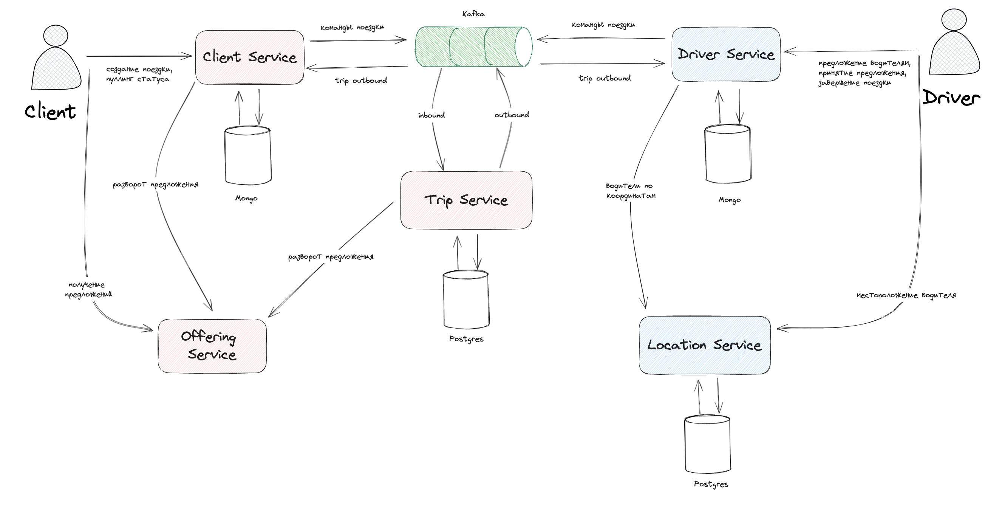
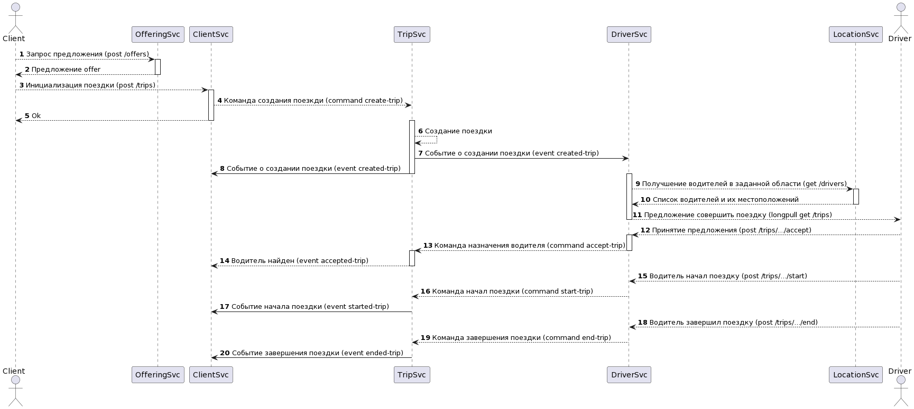
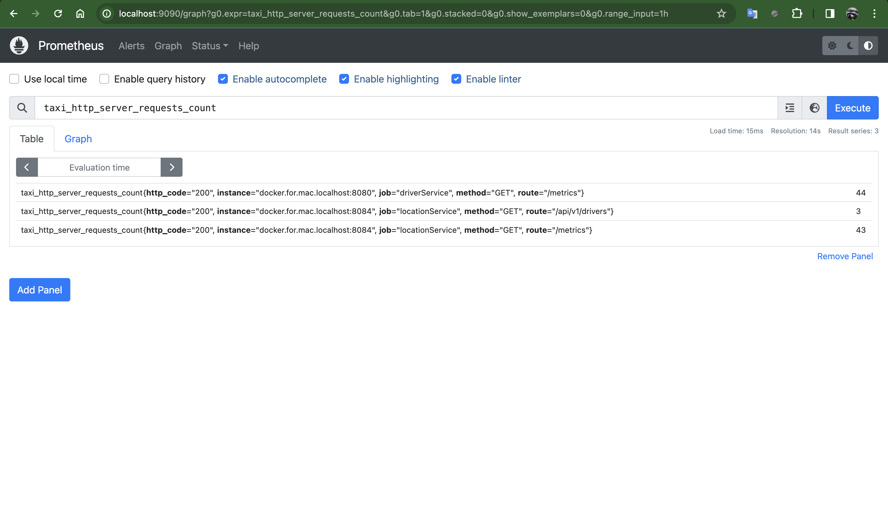
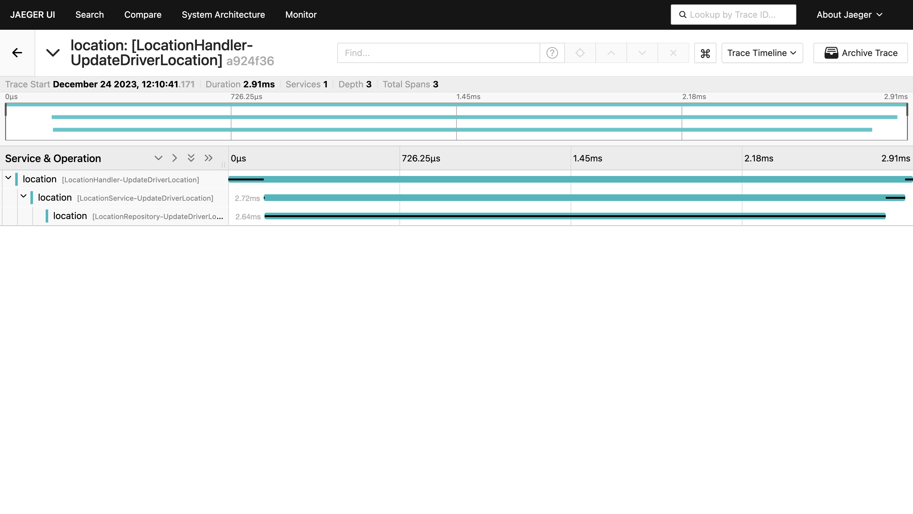
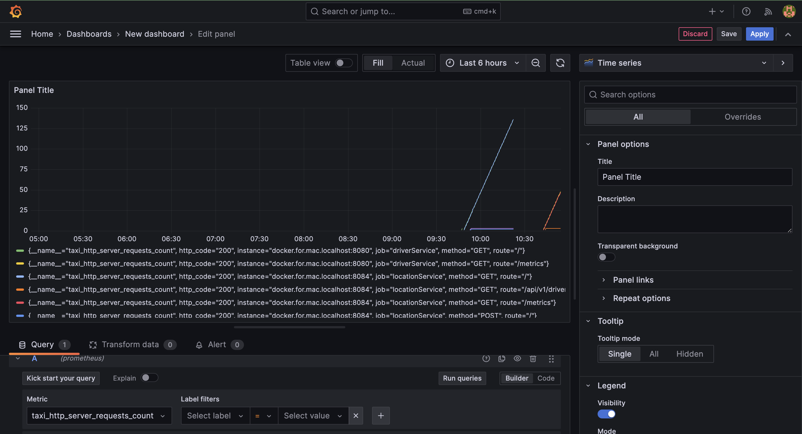
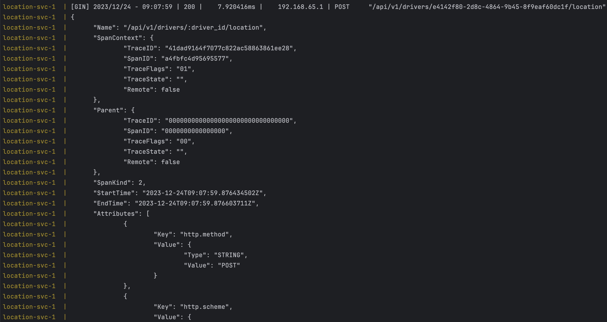

# taxi service
В проекте
- Чистая архитектура и
Проработанный project layout
- Трассировка open telemetry и jaeger
- Настраиваемый логгер
- PostgreSQL, MongoDB с репликами и consumer/producer клиенты Кафки
- Интеграция веб сокета с  pub/sub
- Функциональный автотест

На каждый слой были сделаны свои модели и конвертеры.

Были разработаны общие библиотеки вынесенные в pkg
- graceful shutdown включавший в себя безопасное создание callback’а из любой точки приложение, детальную настройку тайм-аутов, возможность обработки ошибок и force shutdown
- свой config переписывающий yaml конфиги переменными из env, используя рефлексию
- кастомные метрики и трассировка и другие
- Генерация кода для всех взаимодействий по http
- Использование библиотек earthdistance  для PostgreSQL
- Возможность подключиться к кафке локально (не из docker)

Структура сервисов соответствует общему шаблону. Оформление коммитов стандартизовано для ручного просмотра

Основные выбранные библиотеки: gin, Kafka-go, zap

Общая схема ПС

 Процесс успешной поездки

Метрики (созданная нами):

Трейсы в Jaeger:

Grafana:

Трейсы также пишутся в консоль:

